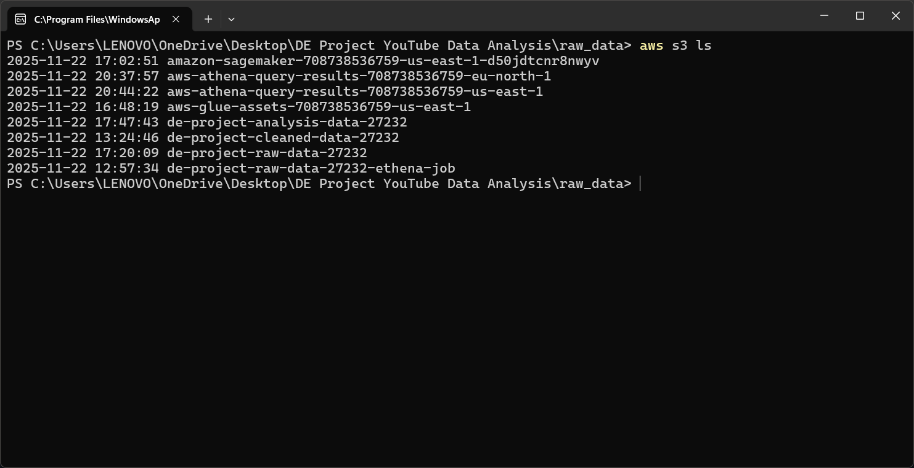
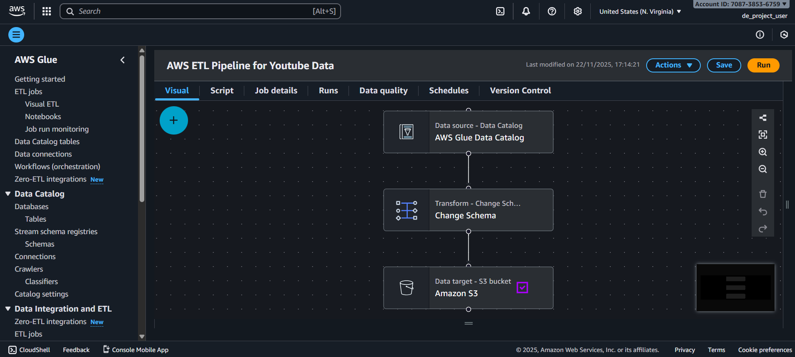
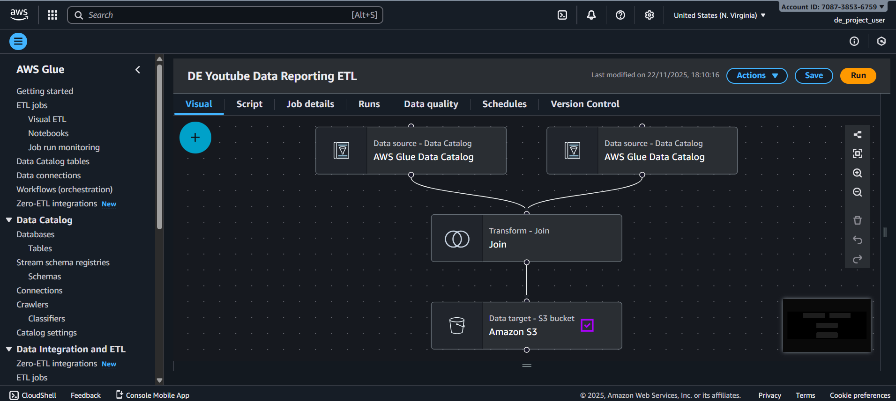
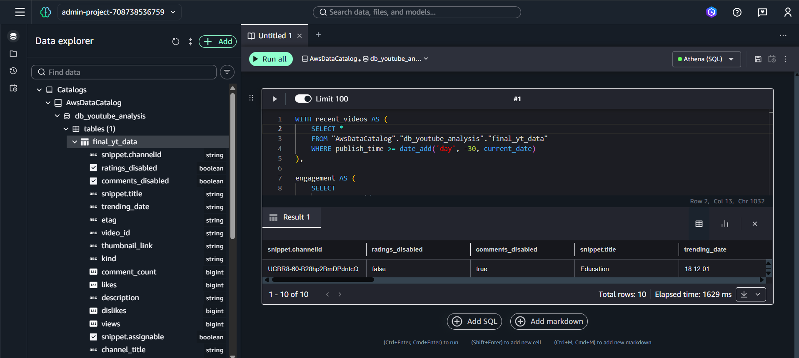
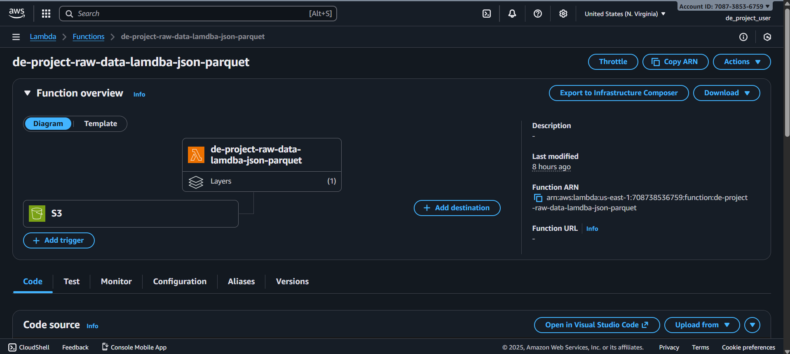
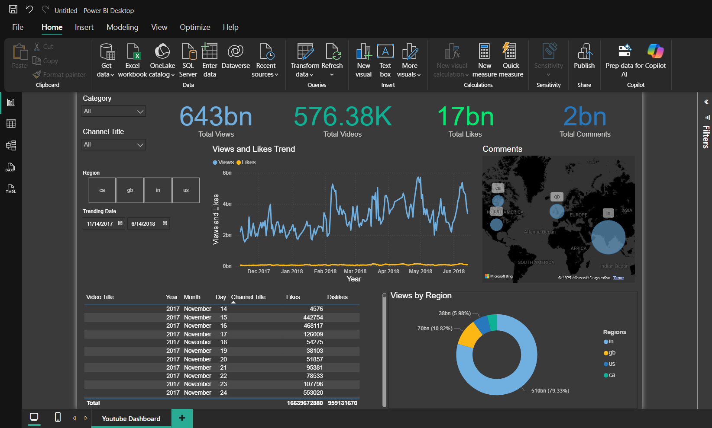

# YouTube's Data Engineering: ETL & Cloud Pipeline Project

---

## Overview

This project aims to securely manage, streamline, and perform analysis on structured and semi-structured YouTube videos data. The analysis focuses on video categories, trending metrics, and engagement statistics.

The system is designed to be **scalable, cloud-based, and interactive**, allowing users to generate insights from large datasets efficiently.

---

## Project Goals

1. **Data Ingestion**  
   Build mechanisms to ingest data from multiple sources securely and efficiently.

2. **ETL System**  
   Transform raw YouTube data into a structured format suitable for analysis and reporting.

3. **Data Lake**  
   Centralize data from multiple sources into a single repository for better accessibility and management.

4. **Scalability**  
   Ensure the system scales with increasing data volumes without performance bottlenecks.

5. **Cloud Integration**  
   Process large-scale data in the cloud using AWS services instead of relying on local machines.

6. **Reporting & Visualization**  
   Build interactive dashboards to generate insights and answer analytical questions using **Power BI**.

---

## AWS Services Used

| Service                                                                                                                 | Purpose                                                                     |
| ----------------------------------------------------------------------------------------------------------------------- | --------------------------------------------------------------------------- |
|          | Object storage service for scalable, secure, and available data storage.    |
|            | Manage access and permissions to AWS resources securely.                    |
|            | Serverless data integration for discovery, transformation, and preparation. |
|      | Run code without managing servers, used for automation tasks.               |
|      | Interactive querying service for data stored in S3 using SQL.               |
|  | Used to visualize data through an interactive dashboard.                    |

## Dataset Used

-   **Source:** [Kaggle - Trending YouTube Videos Dataset](https://www.kaggle.com/datasets/datasnaek/youtube-new)
-   **Description:**  
    The dataset contains statistics (CSV files) on daily trending YouTube videos across multiple regions.  
    Each file contains up to 200 trending videos per day and includes the following fields:

    -   `video_id`, `title`, `channel_title`, `publish_time`, `tags`, `views`, `likes`, `dislikes`, `description`, `comment_count`
    -   `category_id` linked via JSON files for each region

-   **Data Type:** Structured CSV files and JSON for category mapping.

---

## Architecture Diagram

## Folders & Files

-   **`aws_cli_commands.sh`** – AWS CLI commands for S3 bucket (IAM usr configured on aws cli).
-   **`fetch_athena.ipynb`** – Queries Athena and generates **`final_yt_data.csv`** for analysis.
-   **`final_yt_data.csv`** – Cleaned dataset used for analysis and dashboard.
-   **`dashboard.pbix`** – Power BI file with interactive dashboard (KPIs, charts, tables, maps, slicers).
-   **`lambda_function.py`** – AWS Lambda for automated ETL on S3 events.
-   **`pyspark_init_etl.py`** – Initial ETL of raw YouTube data using PySpark.
-   **`pyspark_join_code.py`** – Joins datasets and performs transformations using PySpark.

---

## AWS Services in Action

Below are snapshots showing the working AWS services used in this project.

<table>
  <tr>
    <td></td>
    <td></td>
    <td></td>
  </tr>
  <tr>
    <td></td>
    <td></td>
    <td></td>
  </tr>
</table>

---

## Let's Connect

